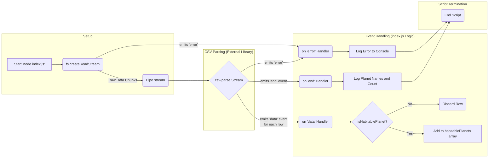

# System Architecture

This document outlines the architecture of the "Awesome Kepler Habitable Planets Finder" project.

## 1. Overview

The project is a simple command-line Node.js application designed to process a Comma Separated Values (CSV) data file containing exoplanet information. Its primary function is to read the data, filter it based on predefined habitability criteria, and output the names and count of planets meeting these criteria to the console. The architecture emphasizes efficient processing of potentially large datasets through streaming.

## 2. Project Folder Structure

The project follows a flat structure:

```
planets-project/
│
├── index.js          # Main Node.js script containing the application logic
├── kepler_data.csv   # Data file with Kepler Objects of Interest
├── package.json      # NPM package definition, dependencies, and scripts
└── node_modules/     # (Generated) Directory containing installed NPM packages
```

## 3. Major Components

- **`index.js` (Application Logic):**
  - The core script orchestrating the process.
  - Uses the built-in `fs` module to read the data file.
  - Integrates the `csv-parse` library to handle CSV parsing.
  - Defines the `isHabitablePlanet` function containing the filtering logic.
  - Manages the data stream and events (`data`, `error`, `end`).
  - Collects results in the `habitablePlanets` array.
  - Formats and prints the final output to the standard output (console).
- **`kepler_data.csv` (Data Source):**
  - A static CSV file containing exoplanet candidate data from the Kepler mission (via NASA Exoplanet Archive).
  - Includes columns like `koi_disposition`, `koi_insol`, `koi_prad`, and `kepler_name`, which are essential for the script's operation.
  - May contain comments (lines starting with `#`) which are ignored during parsing.
- **`fs` (Node.js Module):**
  - The built-in Node.js File System module.
  - Used specifically via `fs.createReadStream` to read `kepler_data.csv` efficiently as a stream.
- **`csv-parse` (NPM Package):**
  - An external library dependency (defined in `package.json`).
  - Provides robust stream-based CSV parsing capabilities.
  - Configured to handle comments and automatically use the first row as column headers.
- **Node.js Runtime:**
  - The environment executing the `index.js` script. Provides the event loop, stream APIs, and module system.

## 4. Data Flow

The application follows a linear, stream-based data flow:

1.  **Initiation:** The script is executed via `node index.js` (or `npm start`).
2.  **File Reading:** `fs.createReadStream('kepler_data.csv')` opens the CSV file and creates a readable stream. Data starts flowing chunk by chunk.
3.  **Piping:** The readable stream from the file is piped (`.pipe()`) into the `csv-parse` stream transformer.
4.  **CSV Parsing:** `csv-parse` receives data chunks, parses them according to CSV rules (handling delimiters, quotes, etc.), and transforms them into JavaScript objects based on the header row (`columns: true`). Comment lines (`#`) are skipped.
5.  **Data Event Handling:** For each successfully parsed row (object), `csv-parse` emits a `data` event.
6.  **Filtering:** The `on('data', ...)` listener receives each planet object. The `isHabitablePlanet(data)` function is called to check if the planet meets the predefined criteria.
7.  **Collection:** If `isHabitablePlanet` returns `true`, the planet object is added to the `habitablePlanets` array in memory.
8.  **Error Handling:** If any error occurs during file reading or parsing, an `error` event is emitted by the relevant stream. The `on('error', ...)` listener catches this and logs the error to the console.
9.  **End of Stream:** When the entire file has been read and parsed, the `end` event is emitted by the `csv-parse` stream.
10. **Output Generation:** The `on('end', ...)` listener triggers. It maps the `habitablePlanets` array to extract just the `kepler_name` for each planet, prints this list, and then prints the total count (`habitablePlanets.length`).
11. **Termination:** The script finishes execution.



## 5. Design Decisions

- **Streaming (`fs.createReadStream` + `pipe`):** Chosen explicitly for memory efficiency. This allows the application to handle very large CSV files without loading them entirely into RAM, preventing potential crashes due to memory exhaustion.
- **Use of `csv-parse` Library:** Leverages a well-tested, feature-rich library for CSV parsing instead of implementing custom parsing logic. This improves robustness and handles edge cases (e.g., quoted fields containing commas).
- **Asynchronous I/O:** Node.js's non-blocking, event-driven nature is well-suited for I/O operations like file reading. Streams fit naturally into this model.
- **Simple State Management:** Results are collected in a simple JavaScript array (`habitablePlanets`). This is sufficient for the current scope but might need revision if the number of results becomes extremely large.
- **Configuration via Code:** Habitability criteria are hardcoded within the `isHabitablePlanet` function. For more flexibility, these could be externalized to a configuration file or command-line arguments.
- **Standard Output:** Results are printed directly to the console, suitable for a simple CLI tool. More complex applications might output to a file, database, or API response.
